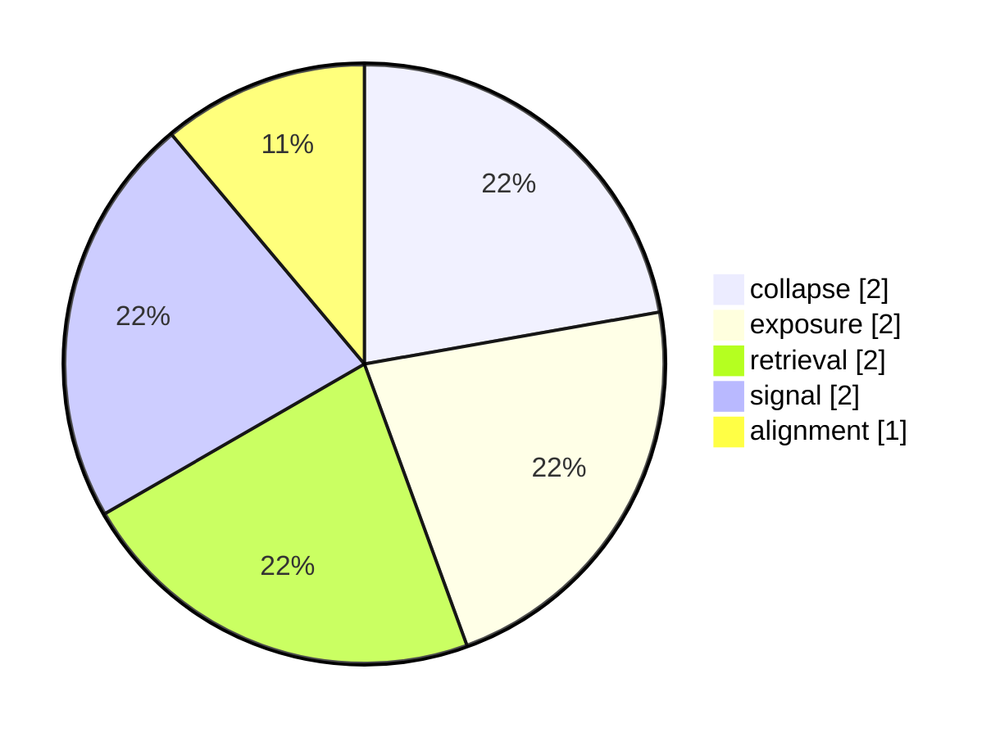

# Weekly Snapshot weekly-2025-W49

- **Range:** 2025-12-01 → 2025-12-07
- **Total events:** 2
- **Dominant themes:** collapse, exposure, retrieval, signal, alignment

---

## Vector distribution (top 5)



## Channel distribution (top 5)

```mermaid
bar
    title Channels (top 5)
    "global aviation" : 1
    "global tech" : 1
```

## Law distribution (top 5)

```mermaid
bar
    title Laws (top 5)
    "FL-02" : 2
    "FL-03" : 2
    "FL-04" : 2
    "FL-05" : 2
    "FL-06" : 2
```

## Notes

Auto-generated weekly register; aggregates FieldState counts only.

## Shape of the week

- **Vector span:** 6
- **Channel span:** 2
- **Law span:** 8
- **Dominant vector cluster:** collapse, exposure, retrieval, signal
- **Unique vectors (count = 1):** alignment, inversion
