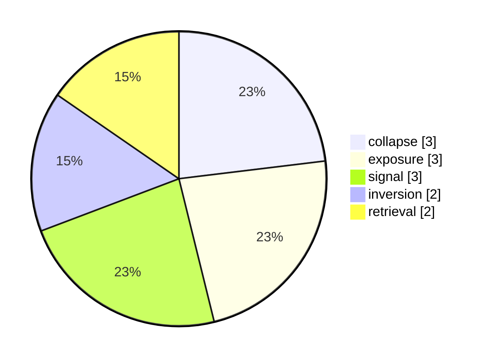

# Weekly Snapshot weekly-2025-W49

- **Range:** 2025-12-01 → 2025-12-07
- **Total events:** 3
- **Dominant themes:** collapse, exposure, signal, inversion, retrieval

---

## Vector distribution (top 5)

## Channel distribution (top 5)

| channel | count | bar |
|---------|-------|-----|
| global aviation | 1 | ▰▰ |
| global tech | 1 | ▰▰ |
| sports | 1 | ▰▰ |

## Law distribution (top 5)

| law | count | bar |
|-----|-------|-----|
| FL-02 | 3 | ▰▰▰▰▰▰ |
| FL-03 | 3 | ▰▰▰▰▰▰ |
| FL-04 | 3 | ▰▰▰▰▰▰ |
| FL-06 | 3 | ▰▰▰▰▰▰ |
| FL-07 | 3 | ▰▰▰▰▰▰ |

## Notes

Auto-generated weekly register; aggregates FieldState counts only.

## Shape of the week

- **Vector span:** 7
- **Channel span:** 3
- **Law span:** 8
- **Dominant vector cluster:** collapse, exposure, signal, inversion
- **Unique vectors (count = 1):** alignment, compression
