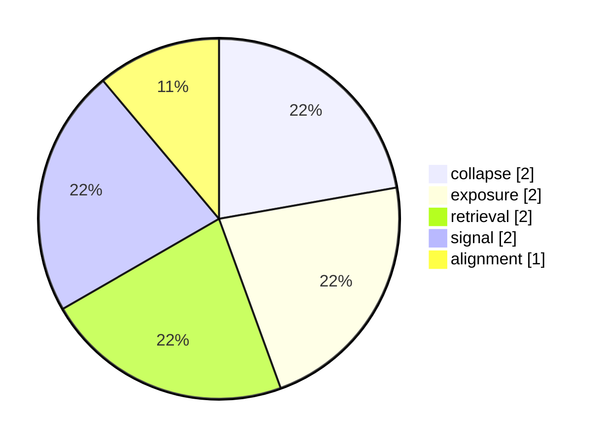

# Weekly Snapshot weekly-2025-W49

- **Range:** 2025-12-01 → 2025-12-07
- **Total events:** 2
- **Dominant themes:** collapse, exposure, signal

---

## Vector distribution (top 5)

## Top channels

| channel | count |
|---------|-------|
| global aviation | 1 |
| global tech | 1 |

## Top vectors

| vector | count |
|--------|-------|
| collapse | 2 |
| exposure | 2 |
| retrieval | 2 |
| signal | 2 |
| alignment | 1 |

## Top laws

| law | count |
|-----|-------|
| FL-02 | 2 |
| FL-03 | 2 |
| FL-04 | 2 |
| FL-05 | 2 |
| FL-06 | 2 |

## Notes

Auto-generated weekly register; aggregates FieldState counts only.
