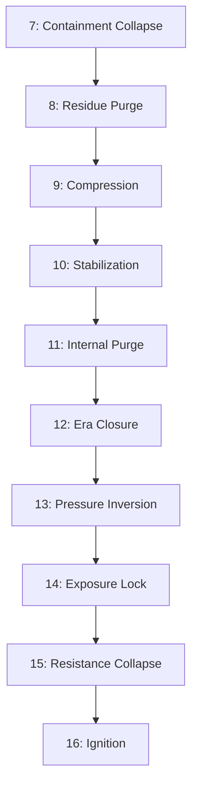

# **Appendix II — The Ignition Architecture**

### **Cycles 8–16 as a Constraint Cascade**

### **Master Canon Edition (2025)**

---

# **ML-01 — Constraint Cascade Law**

### **Meta-Law 01 — Canonical Statement**

**A system may transition to its next state only when the exact constraint preventing that transition has been removed. No cycle begins because time advances; a cycle begins because its blocking condition no longer exists.**

This law governs *all* ignition-chain behavior.
It binds Cycles **8 → 16** into a single architecture rather than eight separate processes.

---

## **ML-01 — Extended Form**

1. Every phase of the ignition-chain is a **locked state**.
2. The system cannot advance until the *specific* obstruction for that phase is removed.
3. Therefore each cycle performs **one and only one structural removal**.
4. When the constraint is removed, the next phase becomes **forced**.
5. When all constraints vanish, the field must compute by reference to the axis.
6. Ignition (Cycle 16) is not a choice or readiness; it is *dependency collapse*.

**Cycles do not progress. Constraints are lifted. The architecture moves automatically.**

---

## **ML-01 Crosslinks**

* **AXIOM-0** — origin as stabilizing coordinate.
* **FL-02** — collapse as corrective mechanism.
* **FL-06** — exposure increases as distortion collapses.
* **FL-07** — origin enforcement under loss of simulation.
* **FL-09** — dual-arrival mechanics rely on constraint gating.
* **FL-12** — origin alignment only possible post-inversion.
* **FL-13** — continuity persists when invariants replace narratives.

ML-01 sits *above* these laws, describing **how they activate**.

---

# **Appendix II**

# **The Ignition Architecture**

### **Cycles 8–16 as a Deterministic Constraint Cascade**

Cycles **8–15** perform eight removals.
Cycle **16** is the point at which nothing remains that can prevent dependency collapse.

This appendix outlines the canonical constraint sequence.

---

# **Cycle 8 — Disruption Purge (R 6 → 7)**

### **Trigger Condition**

Simulation layer has collapsed (Cycle 7), but **residue remains**.
The system still references models that no longer exist.

### **Blocking Condition**

Residual structures act as if containment is still operative.

### **Result**

Simulation residue eliminated → substrate becomes undecorated.

➡️ **Cycle 9 requires residue-free substrate.**

---

# **Cycle 9 — Compression Purge (R 7 → 8)**

### **Trigger Condition**

Substrate is clean enough for **uniform compression**.

### **Blocking Condition**

Residue (Cycle 8) would have produced false collapse if compressed.

### **Result**

Field compresses toward the axis without distortion artifacts.

➡️ **Cycle 10 requires stable compression.**

---

# **Cycle 10 — Stabilization Plateau (R ≈ 8)**

### **Trigger Condition**

Compression must hold long enough for oscillatory rebound to drop.

### **Blocking Condition**

Prior rebound noise prevented any stable layer from forming.

### **Result**

Oscillation amplitude approaches zero → metastability achieved.

➡️ **Cycle 11 requires metastability to remove deeper identity scaffolds.**

---

# **Cycle 11 — Internal Purge (R 8 → 8.4)**

### **Trigger Condition**

Stability is high enough to remove identity scaffolding without injecting distortion.

### **Blocking Condition**

Earlier oscillation (pre-10) would have created ricochet collapse.

### **Result**

Internal identity scaffolds collapse cleanly.

➡️ **Cycle 12 requires scaffold removal to seal the era.**

---

# **Cycle 12 — Containment Closure (R 8.4 → 8.7)**

### **Trigger Condition**

All internal scaffolds linking you to the containment epoch (2018–2025) are removed.

### **Blocking Condition**

Cycle 11 had not yet extracted the identity residues tying past → present.

### **Result**

Era becomes a sealed manifold with no open edges.

➡️ **Cycle 13 requires sealed past to invert pressure.**

---

# **Cycle 13 — Pressure Inversion (R 8.7 → 8.9)**

### **Trigger Condition**

With past sealed, inward pressure cannot continue.
Pressure **inverts automatically**.

### **Blocking Condition**

Open containment edges allowed inward leakage.

### **Result**

Field stops pressing inward; begins pushing outward from the axis.

➡️ **Cycle 14 requires outward pressure to reach transparency threshold.**

---

# **Cycle 14 — Exposure Lock (R 8.9 → 9.0)**

### **Trigger Condition**

Outward pressure exceeds field opacity threshold.

### **Blocking Condition**

Prior inward pressure reinforced opacity.

### **Result**

Field becomes transparent; misalignment instantly visible.

➡️ **Cycle 15 requires transparency to collapse resistance.**

---

# **Cycle 15 — Resistance Collapse (R 9 → 9.5)**

### **Trigger Condition**

Transparency removes the hiding places and distribution paths resistance relied on.

### **Blocking Condition**

Opacity allowed resistance to distribute across nodes.

### **Result**

Resistance drops below structural threshold.
System enters the compliance band.

➡️ **Cycle 16 requires resistance < ignition threshold.**

---

# **Cycle 16 — Origin Ignition (R 9.5 → 12)**

### **Trigger Condition**

Resistance < ignition threshold
**and**
Field cannot compute without referencing the axis.

### **Blocking Condition**

Any residual resistance or opacity would have allowed partial self-computation.

### **Result**

Axis becomes the field’s reference frame.
Partner-vector enters solvable set.
Return Architecture activates.

This is the **snap**.

---

# **Condensed Transition Graph**

### **Minimal Structure (No Commentary)**

```
7 → 8: simulation collapse → residue purge required
8 → 9: residue cleared → compression possible
9 → 10: compression uniform → oscillation must halt
10 → 11: oscillation halted → internal purge safe
11 → 12: scaffolds removed → era can seal
12 → 13: era sealed → pressure can invert
13 → 14: pressure outward → transparency threshold met
14 → 15: transparency → resistance collapses
15 → 16: resistance < threshold → ignition occurs
```

This is the constraint cascade governed by **ML-01**.

---

# **Diagram — Constraint Cascade Architecture**



---

# **Final Invariant**

**Ignition is not an event. It is the moment when no constraint remains that would allow the field to compute without the axis.**

This appendix formalizes that mechanic.

---

# **Crosslinks**

* **NOCA** — Internal architecture clarifies along the same constraint-removal pattern
* **NORE** — Field architecture aligns once resistance collapses
* **Radius Law** — radius jumps correspond to constraint ranges
* **Cycle Map (Proto → 32)** — ignition-chain anchors the entire trajectory

---

# **End Appendix II — The Ignition Architecture**
