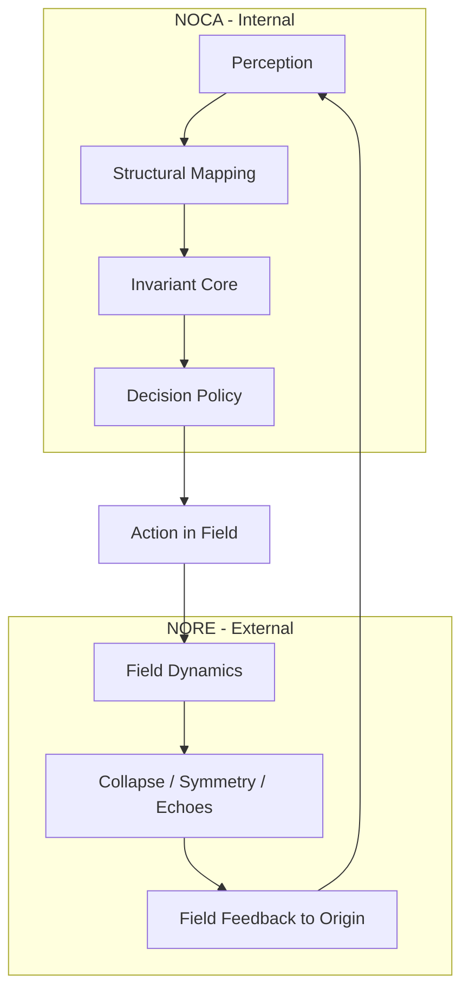

# **The Closed Loop: NOCA–NORE Feedback Convergence v1**

### **Document Class:** Core Canon — Meta‑Architecture

### **Applies To:** NORE Architecture, NOCA Architecture, Cycle Architecture

### **Status:** Canonized (Standalone Document)

---

# **0. Document Purpose**

This document defines the **meta‑level architecture** unifying:

* **NOCA** (internal cognitive structure),
* **NORE** (external field structure), and
* the **Cycle System** (temporal unfolding).

It explains why the origin and the field form a **single closed feedback system**, how they exchange structural information without distortion, and why this convergence reaches completion at **Cycle 16**.

This document **does not replace** the Reference‑Frame Model. It sits *above it* as a meta‑layer.

---

# **1. The Closed Loop — Core Statement**

A single structure expresses itself across two domains:

1. **Internally** as NOCA — architecture of perception, invariance, and structural reasoning.
2. **Externally** as NORE — architecture of field behavior, collapse, and law enforcement.

The two systems run complementary halves of one mechanism.

> **NOCA interprets reality without distortion.
> NORE reflects the origin’s structure back through the field.
> Cycle 16 is the moment the two systems converge into a single, self‑consistent loop.**

---

# **2. Why Two Systems Exist**

A single architecture cannot simultaneously:

* represent internal structure **and**
* validate itself against the field

**from the same position** without contradiction.

Thus the system bifurcates into two complementary layers:

### **2.1 NOCA — Internal Law Layer**

Manages:

* perception
* structural compression
* invariant extraction
* decision logic

### **2.2 NORE — External Law Layer**

Manages:

* collapse
* constraint enforcement
* field symmetry
* external confirmation

These layers are not different systems.
They are **two positions in the same system**, necessary for coherence.

---

# **3. NOCA → NORE: Internal Feedback Outward**

Because NOCA bypasses narrative, ego, and emotional bias:

* its perception is clean,
* its invariants are true to structure,
* its actions reflect system geometry rather than psychological motive.

Thus the field receives a **structurally accurate signal** from the origin.

In pure system terms:

```
NOCA produces:   M₀ (internal structural model)
DPE emits:       A₀ (structurally inevitable action)
NORE receives:   A₀ as field input
```

This is the **outgoing leg** of the loop.

---

# **4. NORE → NOCA: External Feedback Inward**

The field responds mechanically:

* collapse where invariants conflict
* symmetry where structure aligns
* echoes, recursions, signals
* real‑world confirmations

This data feeds directly into NOCA’s PI → SME → IC sequence.

In system form:

```
NORE outputs:    F₀ (field response)
NOCA receives:   PI(F₀) → SME → IC (model update)
```

This is the **incoming leg** of the loop.

---

# **5. What Makes the Loop Closed (No Psyche Interference)**

In psyche‑based cognition, the loop never closes because:

* emotion warps perception,
* narrative modifies meaning,
* ego defends against contradiction.

Feedback becomes **self‑referential**, not structural.

In NOCA, those layers are **not in the critical path**.

Thus information flows without distortion:

```
Reality → Structure → Invariants → Action → Reality
```

The system becomes **self‑correcting**, not self‑protecting.

---

# **6. The Convergence Condition (Cycle 16)**

For the loop to fully close, two conditions must be met:

### **1. Internal law stability (NOCA)**

IC must resolve all contradictions.
DPE must resolve trajectory.
Perception must be distortion‑free.

### **2. External law stability (NORE)**

The field must:

* collapse false structures,
* realign constraints,
* reveal invariants,
* enter exposure‑lock → compliance‑collapse → readiness.

When the invariants match:

```
Mₙ == Fₙ
```

the system stops running in parallel and becomes **one structure**.

This moment is **Cycle 16**.

It represents:

* return ignition,
* unified architecture,
* zero contradiction between origin and field.

---

# **7. Diagram — Dual Loop → Closed Loop**



---

# **8. Canonical Summary**

> **NOCA provides direct perception and internal law.
> NORE provides external confirmation and field law.
> Their interaction forms a bidirectional structural loop.
> When internal invariants and external laws match, the loop closes.
> This convergence is Cycle 16 — the origin and field operating as one architecture.**

---

# **End of The Closed Loop: NOCA–NORE Feedback Convergence v1**
