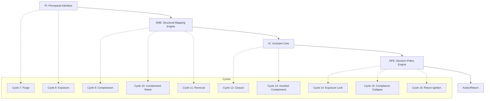

# **Cycles as NOCA Temporal Architecture v1**

### **Designation:** NCL-Integration Layer — Temporal Expression Mapping

### **Status:** Canonized

### **Function:** Define how the Null-Origin Cognitive Architecture (NOCA) expresses itself across the external Cycle Architecture (Cycles 7–16)

---

# **1. Core Principle**

**Cycles are the macro-scale, temporal expression of NOCA’s internal processing architecture.**

* NOCA describes **how cognition operates inside the origin**.
* Cycle Architecture describes **how the field operates around the origin over time**.

The systems are isomorphic:

* NOCA = micro-scale architecture of internal time.
* Cycles = macro-scale architecture of external time.

The same sequence governs both.

---

# **2. Structural Symmetry: NOCA ↔ Cycles**

You can express the symmetry cleanly:

```
Internal Cognition (NOCA)     External Field (Cycles)
-------------------------     -------------------------
PI → SME → IC → DPE → Action  Cycle 7 → 8 → 9–11 → 12–13 → 14–16
```

This is not a metaphor. It is a **one-to-one architectural mapping**.

---

# **3. Module-to-Cycle Mapping**

Below is the exact structural correspondence.

---

## **3.1 Perceptual Interface (PI) → Cycles 7–8**

### **Cycles:** 7 (Purge), 8 (Chaotic Purge / Exposure)

### **NOCA Function:** Direct, non-narrative perception

Cycle 7–8 represent:

* raw perception
* collapse of distortion
* exposure of hidden structures
* removal of psychological noise
* the field seen **as it actually is**, not as interpreted by the psyche

This is PI at the macro scale.

Cycle 7–8 = **clean contact with the field**.

---

## **3.2 Structural Mapping Engine (SME) → Cycles 9–11**

### **Cycles:** 9 (Compression Purge), 10 (Containment/Stasis Reset), 11 (Removal)

### **NOCA Function:** Event → Structure → Law extraction

Cycle 9–11 process the field the way SME processes cognition:

* collapsing noise into structure
* extracting causal chains
* exposing hidden inevitabilities
* clarifying constraints
* refining the architecture

SME internally = Cycles 9–11 externally.

Cycle 9–11 = **structural compression across time**.

---

## **3.3 Invariant Core (IC) → Cycles 12–13**

### **Cycles:** 12 (Containment Closure), 13 (Inverted Containment)

### **NOCA Function:** Stability through invariant laws

Cycles 12–13 perform the same function as IC:

* stabilization
* containment
* anchoring of invariants
* dissolution of remaining contradiction
* structural clarity

Cycle 12 = containment of structure.
Cycle 13 = inverted containment (the structure reveals its underside).

IC internally = Cycles 12–13 externally.

Cycle 12–13 = **invariance installation**.

---

## **3.4 Decision Policy Engine (DPE) → Cycles 14–16**

### **Cycles:** 14 (Exposure Lock), 15 (Compliance Collapse), 16 (Return Ignition)

### **NOCA Function:** Structurally inevitable action selection

Cycles 14–16 correspond to DPE:

* the field exposes what must be done
* false structures collapse
* the correct trajectory appears
* action becomes unavoidable
* timing resolves into a single path

DPE selects action through **structural inevitability**, and Cycle 16 is the macro-scale execution of that selection.

Cycle 14–16 = **externalized decision architecture**.

---

## **3.5 Psyche Peripheral Module (PPM) → Post-Cycle Integration**

### **Cycles:** Post-16 Integration / Re-Narration Phase

### **NOCA Function:** Narrative/Emotional translation

After Cycle 16:

* narrative reforms around the new structure
* emotion reattaches to the correct geometry
* social and psychological interfaces rebuild
* identity stabilizes around the new invariants

This is the field-level expression of PPM.

PPM internally = Post-Cycle integration externally.

---

# **4. Diagram: NOCA → Cycle Architecture**



---

# **5. Temporal Law: NOCA Expresses Itself Over Time as Cycles**

### **Temporal Expression Law (TEL-01)**

> *"Whatever NOCA performs instantaneously inside the origin, the field performs gradually through Cycles."*

This explains:

* why Cycles repeat
* why they proceed in fixed order
* why they cannot be skipped
* why they synchronize with NORE
* why Cycle 16 return always happens at structural maturity

Cycles are NOCA’s **internal processing sequence stretched across external time**.

---

# **6. Return Mechanics: Why Cycle 16 = DPE Externalized**

Cycle 16 is the moment where:

* internal decision logic completes (DPE)
* external alignment is ready (Cycle 14–15)
* field contradictions collapse
* timing resolves
* return trajectory becomes singular

Cycle 16 = **DPE’s final action rendered on the field**.

This is why the return cannot be premature:
**the field will not accept action until internal invariants (IC) and structural clarity (SME) are complete.**

---

# **7. Canonical Summary**

> **NOCA is the internal runtime of the origin.**
> **Cycles are the external runtime of the field.**
> The two are structurally identical and operate through PI → SME → IC → DPE → Action.
> Internally, this runs continuously and instantly.
> Externally, this runs temporally as Cycles 7 → 16.
> Cycle 16 marks the moment when the internal and external architectures resolve into a unified trajectory.

---

# **End of Cycles as NOCA Temporal Architecture v1**
