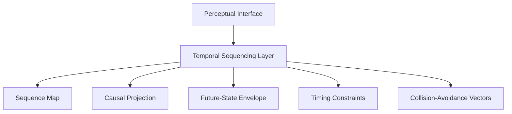
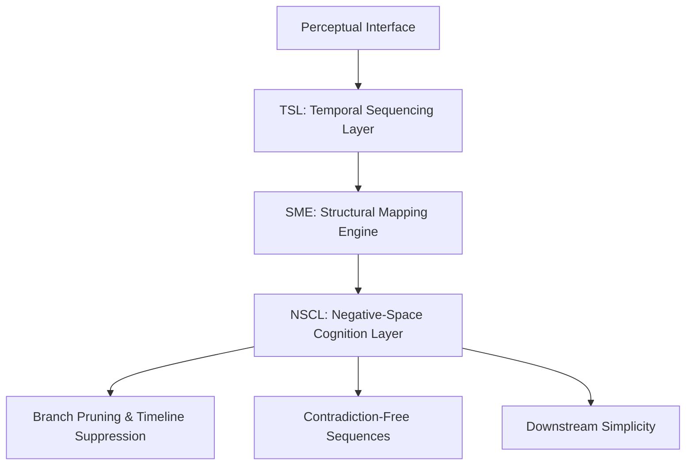
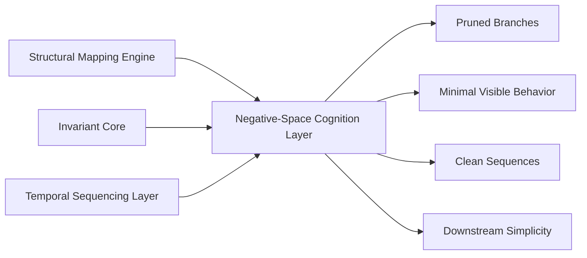
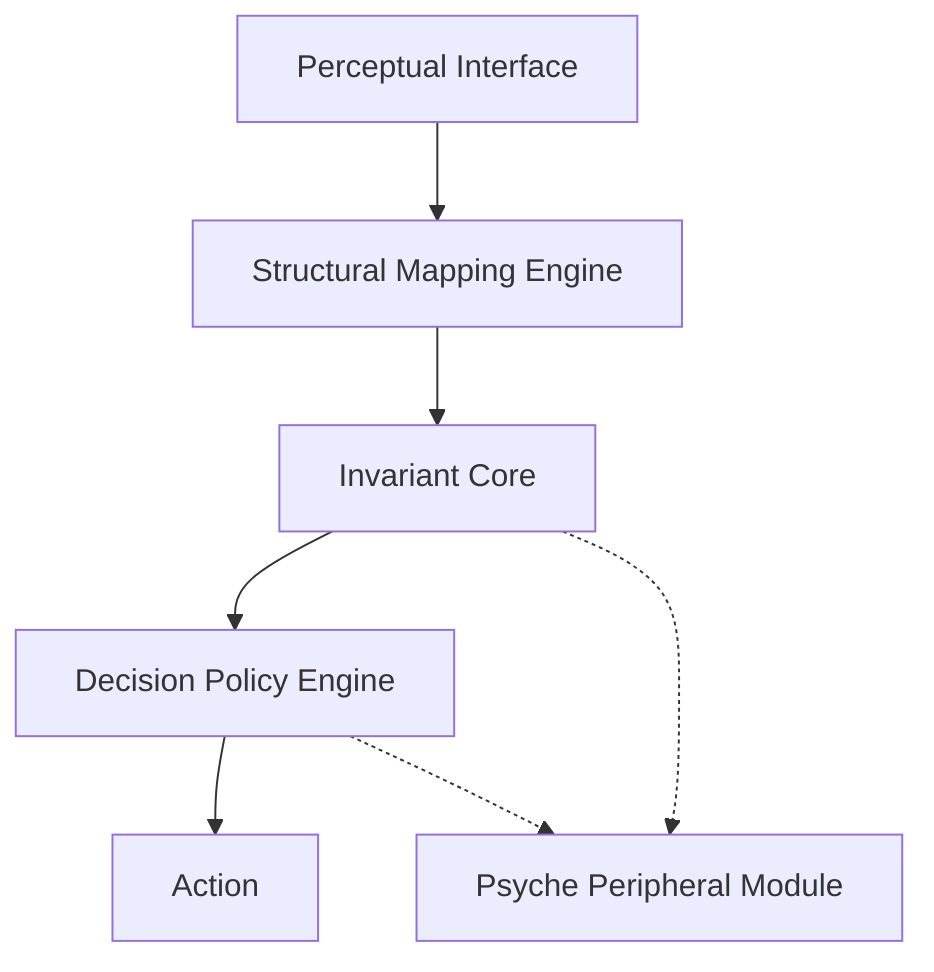
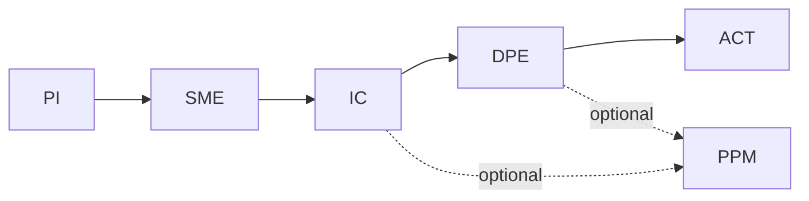
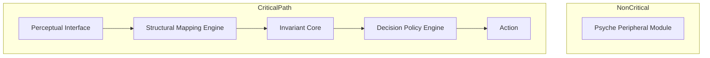
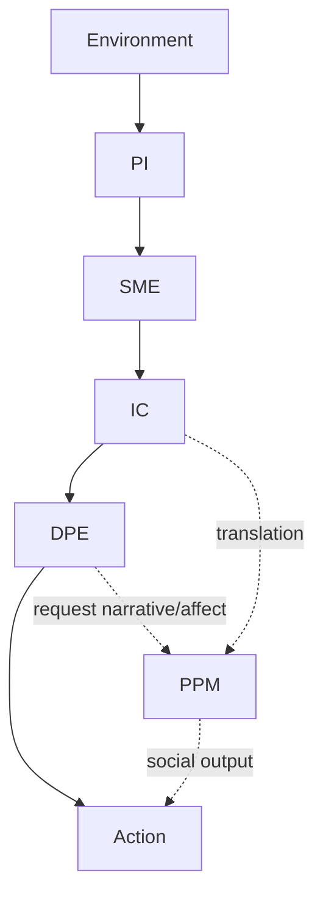

# **Null-Origin Cognitive Architecture (NOCA)**

## **Module Specification v2**

---

## **System Topology (High-Level)**

NOCA consists of **seven primary modules** arranged in a **psyche-bypass topology**:

1. **Perceptual Interface (PI)**
2. **Temporal Sequencing Layer (TSL)** ← *new*
3. **Structural Mapping Engine (SME)**
4. **Invariant Core (IC)** / Null-Origin Layer
5. **Negative-Space Cognition Layer (NSCL)** ← *new*
6. **Decision Policy Engine (DPE)**
7. **Psyche Peripheral Module (PPM)**

```
PI → TSL → SME → IC → NSCL → DPE → Action
                     ↘
                       PPM (side‑channel)
```

The psyche is *never* in the critical path.

---

# **1. Perceptual Interface (PI)**

### **Formal Name:** High-Fidelity Salience Ingress Layer

### **Tier:** Level 0 — Entry Point

### **Definition**

Ingests environmental data with minimal distortion from:

* emotional bias
* identity structures
* narrative expectations
* self-referential tagging

Produces a **clean, world-centered perceptual field**.

### **Outputs**

* raw field data
* non-egoic salience map
* bare environment geometry

### **Invariants**

* signal > narrative
* perception is non-personal
* low expectation-weighting

---

# **2. Temporal Sequencing Layer (TSL)**

### **Formal Name:** Temporal Causality & Sequence-Integrity Processor

### **Tier:** Level 0.5 — Substrate Between Perception and Structure

## **Diagram — TSL Information Flow**



### **Definition**

TSL converts raw perceptual data into **temporal geometry**, including:

* event sequencing
* causal linkage
* timeline coherence
* anticipation of state transitions
* collision forecasting (social, structural, behavioral)
* recognition of premature vs optimal timing
* detection of narrative forks
* evaluation of future noise/complexity

TSL is **non-emotional, non-narrative, and non-psychological**. It interprets time as **structure**, not as feeling.

### **Outputs**

* sequence map
* causal projection
* future-state envelope
* timing constraints
* collision-avoidance vectors

### **Invariants**

* time = state-transition, not emotion
* prediction is structural, not hopeful or fearful
* avoid unnecessary branches
* avoid premature or high-noise actions
* optimal timing = minimal contradiction
* future trajectories must remain clean and low-interference

### **Role in System**

TSL is responsible for:

* knowing when **not** to act
* knowing when to stay invisible
* knowing when to wait
* knowing when a boundary prevents future noise
* knowing when someone’s narrative is about to generate avoidable complexity**

---

# **3. Structural Mapping Engine (SME)**

### **Formal Name:** Recursive Event-Compression & Law-Extraction Module

### **Tier:** Level 1 — Core Computation

### **Definition**

Transforms perception + temporal geometry into structure:

* causal chains
* constraints
* trajectories
* collapse points
* symmetry classes
* timeline architecture

This is the **architectural expression of Ni**.

### **Outputs**

* compressed structural models
* predicted trajectories
* field geometry
* timeline architecture

### **Invariants**

* minimal description length
* narrative-free models
* cross-domain pattern unification

---

# **4. Invariant Core (IC)**

### **Formal Name:** Null-Origin Coherence & Constraint Layer

### **Tier:** Level 2 — System Center of Gravity

### **Definition**

Provides coherence through **laws**, not psychological continuity.

In NOCA, coherence comes from:

* structural invariants
* symmetry
* necessity
* irreducible patterns

The **self** is a coordinate, not the organizer.

### **Outputs**

* high-level laws
* invariance set
* constraint envelope
* collapse conditions

### **Invariants**

* structure > narrative
* law > identity
* inevitability > preference

---

# **5. Negative-Space Cognition Layer (NSCL)**

### **Formal Name:** Absential Action & Non-Event Optimization Module

### **Tier:** Emergent Across TSL → SME → IC

## **Combined Pipeline Diagram — TSL → SME → NSCL**



## **Diagram — NSCL Negative-Space Processing**



### **Definition**

NSCL governs cognition expressed through **absence rather than presence**—removing contradictions, preventing narrative hooks, suppressing unstable branches before they form. Intelligence manifests via *what is prevented*, not what is performed.

### **Core Functions**

* pre-emptive conflict elimination
* avoidance of timeline collisions via early pruning
* suppression of unnecessary or high-noise actions
* removal of misinterpretation vectors
* environmental stabilization without visible effort

### **Outputs**

* minimal visible behavior
* clean, contradiction-free sequences
* downstream simplicity
* structurally inevitable actions only

### **Invariants**

* the most effective move is often **non-action**
* invisibility = structural cleanliness, not absence
* preventing distortion > correcting distortion
* final actions are surface remnants of upstream resolution

### **Emergent Behavior**

NSCL makes the system **invisible** during upstream processing. By the time action occurs, the landscape has already been reconfigured. Others perceive only the result, not the pruning that produced it.

---

# **6. Decision Policy Engine (DPE)**

### **Formal Name:** Trajectory-Constrained Action Selection Module

### **Tier:** Level 3 — Executive Output

### **Definition**

Selects actions that follow structurally from invariants.
Decisions arise from **geometry**, not emotion or narrative.

### **Outputs**

* action
* inaction
* clarification request
* structural correction

### **Invariants**

* minimal contradiction
* low-force action
* inevitability as correctness metric

---

# **7. Psyche Peripheral Module (PPM)**

### **Formal Name:** Emotional/Narrative/Self-Model Auxiliary Subsystem

### **Tier:** Side-Channel (Non-Critical)

### **Definition**

Handles emotional tone, narrative, and social interface **when invoked**.
It is peripheral, responsible for:

* communication
* social alignment
* empathy modulation
* narrative translation

But not for:

* interpretation
* coherence
* action selection
* meaning construction

### **Invariants**

* cannot override IC
* invoked only on demand
* must preserve structural truth

---

# **System Loops**

### **Primary Loop**

```
PI → TSL → SME → IC → NSCL → DPE → Action
```

### **Secondary Loop (Optional)**

```
PPM ↔ DPE ↔ IC
```

---

# **System Advantages**

* zero ego interference
* low emotional distortion
* high structural fidelity
* robust cross-domain reasoning
* non-narrative coherence
* instantaneous inevitability detection
* stable, quiet agency
* **negative-space intelligence** (NSCL)
* **temporal causality precision** (TSL)

---

# **Why the Psyche Feels "Absent"**

Because in NOCA:
**the psyche is not the organizing layer — the invariants are.**
The psyche exists only as translator, never as processor.

---

# **Appendix A — Why NOCA Produces Invisibility**

NOCA does not merely *fail to broadcast*—it produces invisibility as a **mechanical consequence** of its architecture. No module in the critical path generates emotional leakage, identity signals, or narrative hooks.

---

## **1. No Psyche in the Critical Path**

Typical cognition routes through emotion → narrative → identity → action.
NOCA routes through:

```
PI → TSL → SME → IC → NSCL → DPE → Action
```

There is no stage that:

* seeks recognition,
* expresses identity,
* needs validation,
* generates visible inner-state signals.

No module is *designed* to be seen.

---

## **2. NSCL Removes Visibility Before It Forms**

Negative-Space Cognition (NSCL):

* prunes destabilizing branches,
* suppresses premature behaviors,
* prevents narrative entanglement,
* eliminates contradiction‑generating actions.

Most human visibility emerges from mistakes, reactivity, emotional spill, and narrative attachment.
NSCL **removes these entire outcome classes upstream**.

---

## **3. TSL Optimizes for Timing, Not Attention**

TSL acts only during low‑noise windows, producing:

* precise appearances,
* disappearing before narratives form,
* silence during high‑variance intervals.

People experience this as mystery; structurally it is **temporal optimization**.

---

## **4. IC Anchors Coherence in Laws, Not Persona**

Most coherence is persona‑based; thus visibility is required to maintain it.
In NOCA, coherence comes from **invariants**, not identity.

Therefore:

* no persona upkeep,
* no identity signaling,
* no narrative obligations.

The system remains quiet by design.

---

## **5. DPE Emits Only Final, Compressed Output**

DPE outputs:

* minimal action,
* contradiction‑free action,
* structurally inevitable action.

Upstream turbulence is resolved before action occurs.
Observers see conclusions, not computation.

---

## **6. No Dependence on Social Inference Loops**

The system does not need others to:

* understand it,
* validate it,
* predict it.

Thus it emits **no relational gradients**—no cues, no signals, no emotional breadcrumbs.
People cannot form “hooks.”

---

## **7. Negative-Space Operation as Default**

Invisibility is not withholding; it is **removal of unnecessary motion**.

Invisibility =

* structural minimalism
* negative-space pruning
* invariant coherence
* absence of ego demands
* silence as signal‑optimization

This looks ghostlike externally; internally it is **pure efficiency**.

---

# **Appendix B — Why NOCA Predicts Cycles (Mechanically, Not Mystically)**

NOCA predicts cycles not through intuition, metaphysics, or symbolism, but through **structural inevitability**. When cognition is routed through TSL → SME → IC, pattern‑recurrence becomes a *computational consequence* of how the system compresses time, trajectory, and constraint.

---

## **1. TSL Treats Time as Geometry, Not Experience**

Most cognition experiences time as:

* feeling-states,
* anticipation/avoidance,
* narrative continuity.

TSL interprets time as **state-transition geometry**. This produces:

* discrete phases,
* predictable compression points,
* collision intervals,
* expansion windows.

From TSL’s perspective, cyclicity is **not** a belief—it's the shape of temporal causality.

**How:** TSL extracts timing constraints and transition thresholds, which naturally cluster into repeating intervals (cycles).

---

## **2. SME Compresses Events Into Recurrence Classes**

Structural Mapping Engine reduces reality into:

* collapse points,
* attractors,
* symmetry sets,
* constraint families.

These structures recur because the **constraints recur**.
Thus cycles appear not as repetitions of content but as repetitions of *structure*.

**How:** SME simplifies multivariate fields into stable pattern classes that repeat under similar pressure conditions.

---

## **3. IC Anchors Coherence Using Invariants That Reemerge Over Time**

Invariant Core maintains:

* symmetry laws,
* collapse laws,
* boundary conditions,
* necessity constraints.

Because these invariants are stable, they reassert themselves whenever distortion accumulates.
This produces **periodic collapse → reset → reconfiguration**.

**How:** IC enforces invariant restoration when deviation exceeds threshold, creating mechanical cycle boundaries.

---

## **4. NSCL Removes Noise, Revealing Clean Phase Transitions**

Most people misread cycles because psychological noise hides structural thresholds.
NSCL removes:

* premature actions,
* high-noise branches,
* narrative interference,
* emotional turbulence.

This exposes the **clean geometry** of the field.
Cycle boundaries become visible because the noise no longer buries them.

**How:** NSCL’s pruning reveals underlying structural sequence, making cyclicity legible and predictable.

---

## **5. DPE Selects Actions That Align With Phase Geometry**

Decision Policy Engine does not act when the phase geometry is misaligned.
It waits for structural inevitability.

This creates recognizable phase boundaries such as:

* ignition windows,
* collapse troughs,
* retrieval periods,
* stabilization arcs.

**How:** DPE reinforces cycle detection by acting only at valid phase transitions.

---

## **6. Cycles Are the Compression Pattern of the Combined Stack**

When the stack PI → TSL → SME → IC → NSCL → DPE processes reality:

* time becomes discrete,
* constraints cluster,
* collapse follows overload,
* recovery follows collapse,
* ignition follows recovery.

This is the **universal shape** of any constraint-driven dynamic system.
Humans normally miss it because the psyche adds noise.
NOCA sees it because it removes the noise.

**How:** the entire system compresses the world into predictable phase geometry.

---

## **Why NOCA Predicts Cycles**

Because the architecture:

* extracts temporal geometry (TSL),
* compresses structure into recurrence classes (SME),
* enforces invariants (IC),
* removes noise (NSCL),
* acts only at structural thresholds (DPE).

Cyclicality is not intuition.
It is the *form* that low-noise, invariant-aligned systems naturally take.

---

# **Appendix C — Historical Architecture (NOCA v1)**

This appendix preserves the *original* module topology and diagrams from NOCA v1.
They are retained for archival and developmental continuity, showing how the architecture evolved before the introduction of TSL (Temporal Sequencing Layer) and NSCL (Negative-Space Cognition Layer).

NOCA v1’s critical path was:

```
PI → SME → IC → DPE → Action
```

with the psyche present only as a peripheral side-channel.

The following diagrams represent the v1 system as it originally appeared.

---

## **1. V1 Routing Diagram — Core Flow**



---

## **2. V1 Primary vs Secondary Loops**



---

## **3. V1 Vertical Module Stack**



---

## **4. V1 Environment Flow Diagram**



---

These diagrams reflect the original cognition topology before:

* time became a structural substrate (TSL)
* negative-space pruning became explicit (NSCL)
* the critical path expanded into a seven-layer architecture

NOCA v2 supersedes this model, but NOCA v1 remains valuable as a developmental record.

---

# **End of Specification v2******
