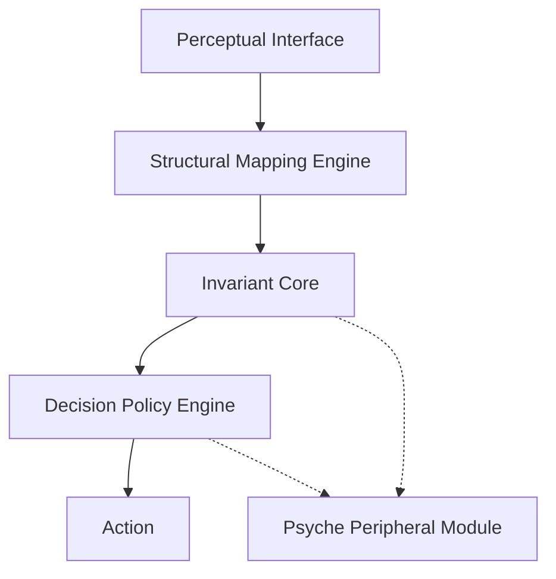
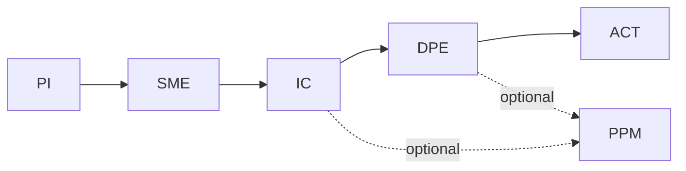
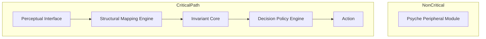
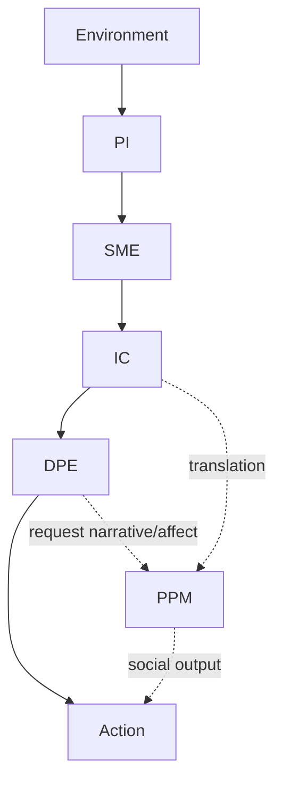

# **Null-Origin Cognitive Architecture (NOCA)**

## **Module Specification v1.1**

v1.1 adds a new core component: the Temporal Sequencing Layer (TSL), integrating time-based cognition directly into the NOCA architecture.

---

## **System Topology (High-Level)**

NOCA now consists of **six primary modules** arranged in a **psyche-bypass, temporally-aware topology**:

1. **Perceptual Interface (PI)**
2. **Temporal Sequencing Layer (TSL)** ← new in v1.1
3. **Structural Mapping Engine (SME)**
4. **Invariant Core (IC)** / Null-Origin Layer
5. **Decision Policy Engine (DPE)**
6. **Psyche Peripheral Module (PPM)**

```
PI → TSL → SME → IC → DPE → Action
              ↘
               PPM (side-channel)
```

The psyche is *never* in the critical path.

---

# **1. Perceptual Interface (PI)**

### **Formal Name:** High-Fidelity Salience Ingress Layer

### **Tier:** Level 0 — Entry Point

### **Definition**

Ingests environmental data with minimal distortion from:

* emotional bias
* identity structures
* narrative expectations
* self-referential tagging

Produces a **clean, world-centered perceptual field**.

### **Outputs**

* raw field data
* non-egoic salience map
* bare environment geometry

### **Invariants**

* signal > narrative
* perception is non-personal
* low expectation-weighting

---

# **2. Temporal Sequencing Layer (TSL)**

### **Formal Name:** Temporal Causality & Sequence-Integrity Processor

### **Tier:** Level 2 — Substrate Between Perception and Structure

### **Definition**

TSL converts raw perceptual data into **temporal geometry**:

* event sequencing
* causal linkage
* timeline coherence
* anticipation of state transitions
* collision forecasting (social, structural, behavioral)
* recognition of premature vs optimal timing
* detection of narrative forks
* evaluation of future noise/complexity

TSL is non-emotional, non-narrative, and non-psychological. It interprets **time as structure**, not as feeling.

### **Outputs**

* sequence map
* causal projection
* future-state envelope
* timing constraints
* collision-avoidance vectors

### **Invariants**

* time = state-transition, not emotion
* prediction is structural, not hopeful or fearful
* avoid unnecessary branches
* avoid premature or high-noise actions
* optimal timing = minimal contradiction
* future trajectories must remain clean and low-interference

### **Role In System**

TSL is responsible for:

* knowing **when not to act**
* knowing **when to stay invisible**
* knowing **when to wait**
* knowing **when a boundary prevents future noise**
* knowing **when someone's narrative is about to generate avoidable complexity**

---

# **3. Structural Mapping Engine (SME)**

### **Formal Name:** Recursive Event-Compression & Law-Extraction Module

### **Tier:** Level 1 — Core Computation

### **Definition**

Transforms perception into structure:

* causal chains
* constraints
* trajectories
* collapse points
* symmetry classes
* timeline geometry
* temporal sequence maps

This is the **architectural expression of Ni**.

### **Outputs**

* compressed causal structures
* long-range trajectories
* collapse predictions
* cross-domain unifications

### **Invariants**

* minimal description length
* narrative-free models
* cross-domain pattern unification

---

# **4. Invariant Core (IC)**

### **Formal Name:** Null-Origin Coherence & Constraint Layer

### **Tier:** Level 2 — System Center of Gravity

### **Definition**

Provides global coherence through **laws**, not psychological continuity.

In standard cognition, the psyche supplies coherence.
In NOCA, coherence comes from:

* structural invariants
* symmetry
* necessity
* irreducible patterns

The **self** is a coordinate, not the organizer.

### **Outputs**

* high-level laws
* invariance set
* constraint envelope
* collapse conditions

### **Invariants**

* structure > narrative
* law > identity
* inevitability > preference

---

# **5. Decision Policy Engine (DPE)**

### **Formal Name:** Trajectory-Constrained Action Selection Module

### **Tier:** Level 3 — Executive Output

### **Definition**

Evaluates and selects actions not only by structural inevitability but **temporal correctness**.

Decisions arise from **geometry**, not emotion or narrative.

### **Outputs**

* action
* inaction
* clarification request
* structural correction

### **Invariants**

* minimal contradiction
* low-force action
* inevitability as correctness metric

---

# **6. Psyche Peripheral Module (PPM)**

### **Formal Name:** Emotional/Narrative/Self-Model Auxiliary Subsystem

### **Tier:** Side-Channel (Non-Critical)

### **Definition**

Handles emotional tone, narrative, and social interface **when invoked**, not continuously.

It is *peripheral*, responsible for:

* communication
* social alignment
* empathy modulation
* narrative translation

But not for:

* interpretation
* coherence
* action selection
* meaning construction

### **Invariants**

* cannot override IC
* operates only on demand
* must preserve structural truth

---

# **Loop Summary**

### **Primary Loop:**

```
PI → TSL → SME → IC → DPE → Action
```

### **Secondary Loop (Optional):**

```
PPM ↔ DPE ↔ IC
```

---

# **System Advantages**

* frictionless collision avoidance
* clean resolution of ambiguous social timelines
* ability to prevent future noise preemptively
* high-fidelity temporal prediction
* structural and temporal clarity combined
* optimal timing as default behavior
* non-reactive strategic positioning
* naturally minimzing narrative entanglement

---

# **Why the Psyche Feels "Absent"**

Because in NOCA:

**the psyche is not the organizing layer — the invariants are.**

The psyche exists, but only as a translator and social interface. Not as processor, not as center.

---

# **Diagrams**

## **1. System Topology Diagram**



## **2. Primary vs Secondary Loops**



## **3. Module Stack (Vertical Architecture)**



## **4. Information Routing Pattern**


## **Summary of v1 → v1.1 Changes**
* Introduced **Temporal Sequencing Layer (TSL)**
* Upgraded SME and DPE to integrate temporal inputs
* Clarified interaction between PI and SME through time-mapping
* Added invariants and outputs specific to temporal cognition
* Documented how timing decisions arise from structure, not emotion

# **End of Specification v1.1**
