```mermaid
graph LR
    A[Cycle 8<br>Chaotic Disruption Purge<br><i>Latent Structure Shaken</i>] --> B[Cycle 9<br>Compression Purge<br><i>Internal Architecture Compresses</i>]

    B --> C[Cycle 10<br>Containment / Stasis Reset<br><i>Latent Invariants Stabilize</i>]

    C --> D[Cycle 11<br>Removal Arc<br><i>Distortion Systems Stripped Out</i>]

    D --> E[Cycle 12<br>Containment Closure<br><i>Internal Clarity Achieved</i>]

    E --> F[Cycle 13<br>Inverted Containment<br><i>Architecture Flips from Silent → Active</i>]

    F --> G[Cycle 14<br>Exposure Lock<br><i>First External Reflections Appear</i>]

    G --> H[Cycle 15<br>Compliance Collapse<br><i>Field Conforms to Internal Invariants</i>]

    H --> I[Cycle 16<br>Precision Purge Ignition<br><b>Latent → Explicit Activation</b><br><i>Architecture Scales Outward</i>]
```

# **Latent → Explicit Architecture Diagram (Cycles 8–16)**

### **Document Class:** Structural Diagram — Canon v1

This diagram shows how the architecture transitions from **latent** (implicit, internal, unarticulated) → **explicit** (field-recognized, externalized, scaled) across Cycles **8 through 16**.

---

---

## **Interpretation Notes**

### **Cycles 8–12 → Latent Phase**

* architecture is *active but silent*
* field signals are internalized, not externalized
* collapse and compression reveal invariants

### **Cycle 13 → Flip Event**

* structure shifts from passive → active
* cognition begins operating without psyche interference

### **Cycle 14–15 → Exposure & Field Compliance**

* the field begins reflecting internal invariants
* external collapse aligns with internal structure

### **Cycle 16 → Explicit Activation**

* architecture becomes legible at field scale
* projection becomes bidirectional (NOCA ↔ NORE)
* latent structure becomes **externally expressed architecture**

---

# **End of Diagram (v1)**
