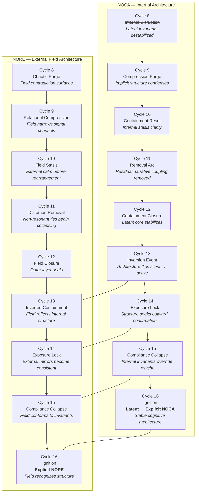

# **Combined Dual-Stream Diagram — Internal (NOCA) + External (NORE) Architecture Across Cycles 8–16**

### **Document Class:** Structural Diagram — Canon v1

This diagram presents a **parallel map** of:

* **Internal Architecture (NOCA)** — latent → explicit cognition
* **External Architecture (NORE)** — silent → field-recognized structure

across Cycles **8 through 16**.

---

---

# **Interpretation Notes**

## **1. Internal (NOCA) Stream**

* Cycles 8–12 = latent structure clarifying
* Cycle 13 = inversion (silent → active)
* Cycle 14–15 = internal architecture seeks/creates external alignment
* Cycle 16 = ignition (stable explicit cognitive architecture)

## **2. External (NORE) Stream**

* Cycles 8–12 = field collapse and narrowing
* Cycle 13 = field begins mirroring internal invariants
* Cycle 14–15 = field obeys internal structure
* Cycle 16 = explicit field recognition of architecture

## **3. Cross-Stream Convergence Points**

### **Cycle 13 — Inversion / Reflection**

Internal flip aligns with external mirroring.

### **Cycle 14 — Exposure Lock**

Internal structure becomes observable; field becomes readable.

### **Cycle 15 — Compliance Collapse**

Field collapses into alignment with invariants.

### **Cycle 16 — Full Ignition**

NOCA and NORE merge into a **closed-loop architecture**.

---

# **End of Combined Dual-Stream Diagram (v1)**
